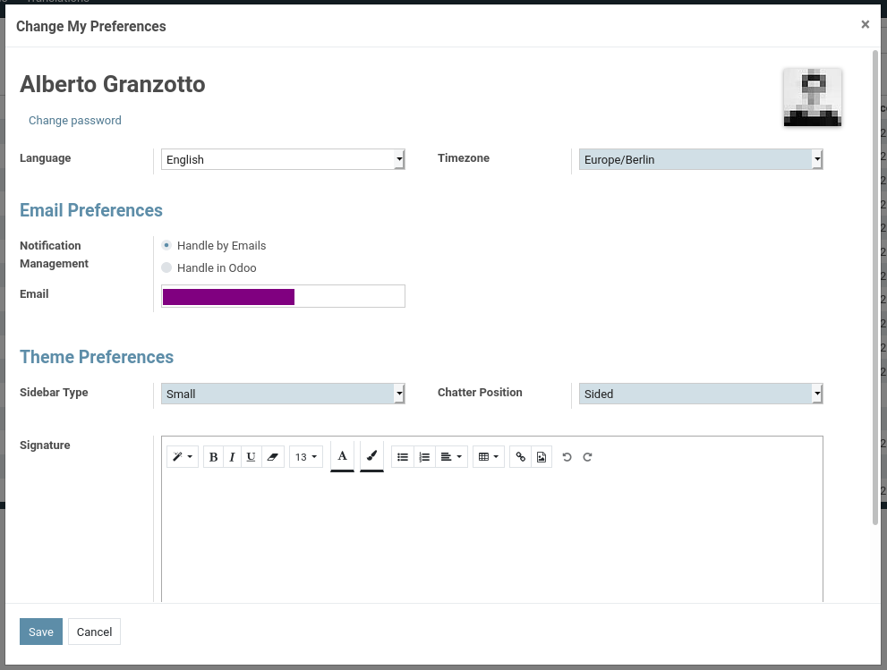
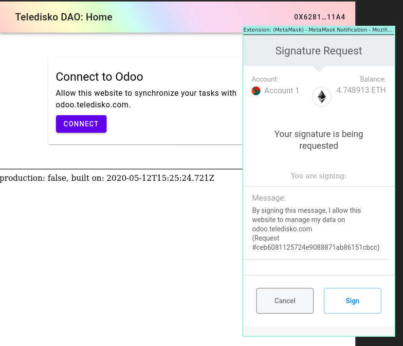
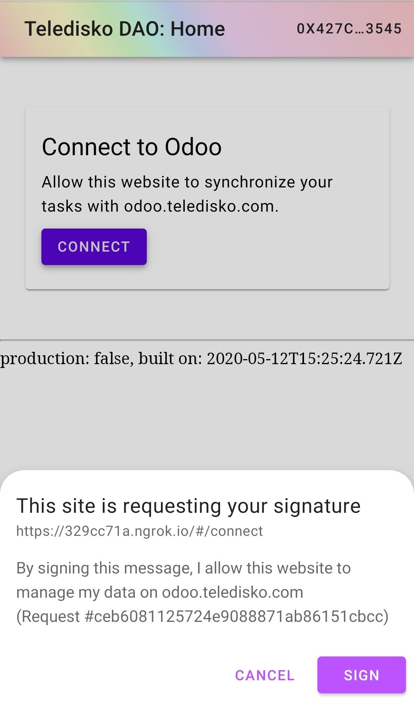

```
TIP: 2
Name: Public Key Authentication Protocol for Odoo API
Type: Standard
Status: raw
Editor: Alberto Granzotto @vrde
Contributors: Peter Schwarz @peterschwarzhpi

```

# Public Key Authentication Protocol for Odoo API

This document is governed by [TIP-0](../0).

## 1 Abstract

A Public Key Authentication protocol for Odoo would allow Teledisko contributors to authenticate to the DAO and Odoo seamlessly. This protocol discuss how to generate, use, and refresh JWT tokens that can be used by the client to talk to Odoo.

## 2 Motivation

Public Key Authentication (PKA) is an alternative method to log in to a service. PKA is widely used both by humans and machines to authenticate data, connect to remote servers, and enable high security protocols like HTTPs (TLS). PKA is also the preferred method to log in to decentralized applications. Teledisko contributors interact with the Teledisko DAO using a dApp, in which they log in using PKA. The Teledisko DAO dApp interacts with smart contracts on one side, and with the Odoo ERP system on the other. In order to talk to Odoo, the dApp needs to authenticate to its API. One solution would be to use the classic username and password authentication method, but it would be cumbersome to have two authentication methods, one for the Ethereum blockchain and the other one for Odoo. Given that Teledisko contributors use a Web3 enabled browser that holds their credentials (i.e. public and private keys), we decided to implement an authentication module for Odoo, to allow it to understand public key authentication.

Once implemented, this specification will allow API authentication using PKA. To keep the scope small, this specification doesn't add nor replace the standard log in for Odoo.

In general, the Web is also moving towards PKA: a specification called [WebAuthn][webauthn] is emerging to allow PKA for regular web apps, and some browser already implemented part of the [Credential Management API][credential-management].

## 3 Specification

### 3.1 Prerequisites

- A Teledisko contributor has an Odoo account.
- A Teledisko contributor has an Ethereum address that identify them in the DAO.
- A Teledisko contributor uses a Web3-enabled browser to interact with the dApp.

Note: an *Ethereum address* is **not** the public key. Instead, the address is **derived** from the public key with this formula:

```
address = '0x' + first_20_bytes(keccak256(public_key))
```

### 3.2 Add the user's address in Odoo

Odoo has no idea on what is the contributor's Ethereum address. For this reason we should add to Odoo a new field that represents that address. The most intuitive place to add it would be in the **User's Preferences** dialog depicted below.



A new text field with the following properties MUST be displayed:

- Label: SHOULD be "Ethereum Address"
- Field: MUST allow a text input of at least 42 characters.

The text field SHOULD validate the address using the [`pattern`][mdn:pattern] attribute of the `input` element, using the regexp `/0x[0-9a-fA-F]{40}/`.

The text field MAY validate the address using [EIP-55][eip-55].

### 3.3 High level flow

The **client** is dApp, the **server** is Odoo.

- Authentication:
  - Client: request the **signing token** to the server.
  - Server: return the **signing token**
  - Client: prompt the user to sign the **signing token**.
  - User: sign the **signing token** using their Web3-enabled browser features (e.g. MetaMask, hardware wallet, etc).
  - Client: submit the **signing token** together with the user-generated signature.
  - Server: validate the signature and reply with an **access token**.
- Authorization:
  - Client: make authenticated calls to the Odoo API by adding the **access token** in the HTTP headers.

### 3.4 Authentication

To authenticate to Odoo, a user has to prove ownership of the Ethereum address. The proof is done by signing a message generated by the server.

#### 3.4.1 Client: request the signing token

The client makes an HTTP GET request to `<API_ROOT>/web3/auth`.

#### 3.4.2 Server: return signing token

The server MUST expose a `GET` API endpoint at `<API_ROOT>/web3/auth`. The endpoint returns a string called *signing token*, that will be eventually signed by the client. The server MUST be able to verify the integrity and authenticity of the *signing token*. A JSON Web Token satisfies the requirements of integrity and authenticity, so the server MUST format the *signing token* as a JWT and return it in its encoded form.

The structure of the JWS **signing token** is the following:
```
Header:
{
  "alg": "<ALGORITHM>",
  "typ": "JWT"
}

Payload:
{
  "message": "By signing this message, I allow this website to manage my data on <DOMAIN>\n(Request #<NONCE>)"
  "exp": <EXPIRATION_TIME>
}
```

`ALGORITHM` is up to the specification implementer. If unsure, `HS256` can be used.

`DOMAIN` MUST be set to the domain of the API server.

`NONCE` is a random number or string with enough entropy. UUID version 4 does a nice job on that.

`EXPIRATION_TIME` defines when the JWT token expires. The expiration time SHOULD be set 10 minutes ahead of the current time to allow users to interact with their Web3 agent (e.g. MetaMask or an hardware wallet).

#### 3.4.3 Client: prompt the user to sign the signing token

The client unpacks the JWT **signing token** from the response of the server, extracts the `message` from the payload, and asks the Web3-enabled browser to sign a message.

#### 3.4.4 User: sign the signing token

The user is promped with to sign the token. How this happens depends on what kind of wallet the user has installed. For example, if the user is using MetaMask a popup asks the user to sign the message. If the user is on a hardware wallet, the message is displayed on the screen of the external hardware device.

##### 3.4.4.1 Example: signature request on desktop

After clicking **Connect**, MetaMask on FireFox prompts the user to sign the authentication message.



##### 3.4.4.2 Example: signature request on mobile

After tapping **Connect**, Opera Mobile prompts the user to sign the authentication message.



#### 3.4.5 Client: submit the signing token and signature to the server

If the user denies the signature, the client MUST display a message to warn the user that the dApp cannot connect to Odoo.

If the user signs the message, the client MUST do an HTTP POST request to `<API_ROOT>/web3/auth` with:

- `signing_token`: the original JWT **signing token**.
- `signature`: a hex encoded string starting with `0x`.

The request MUST be encoded with `application/x-www-form-urlencoded`.

#### 3.4.6 Server: validate the signature and return an access token

The server MUST expose a `POST` API endpoint at `<API_ROOT>/web3/auth`. The parameters passed in the POST are encoded with `application/x-www-form-urlencoded` and are:

- `signing_token`: the original JWT **signing token**.
- `signature`: a hex encoded string starting with `0x`.

The server MUST validate the integrity and authenticity of the JWT **signing token**.
The server MUST extract the **signer address** from the signature and check if there is a user in Odoo associated with that **signer address**.

If both validations succeed, the server replies with a JWT **access token** that allows access in the name of the aforementioned user.
If not, the server MUST reply with a `403` HTTP code.

The structure of the JWS **access token** is the following:
```
Header:
{
  "alg": "<ALGORITHM>",
  "typ": "JWT"
}

Payload:
{
  "sub": <ADDRESS>,
  "exp": <EXPIRATION_TIME>,
  "role": "user"
}
```

`ALGORITHM` any cryptographic algorithm to ensure security and integrity MUST be used. If unsure, go for `HS256`.

`ADDRESS` MUST be set to the value of the **signer address**.

`EXPIRATION_TIME` defines when the JWT token expires. The expiration time SHOULD be set 30 days ahead of the current time.

### 3.5 Authorization

#### 3.5.1 Client: make authenticated calls to the server

After the client receives the **access token** it SHOULD store it in the user agent storage.

The client, to make an authenticated HTTP request to the Odoo system, MUST include the **access token** in the HTTP header: `Authorization: Bearer <ACCESS_TOKEN>`.

#### 3.5.2 Server: reply to an authenticated call

The server MUST validate the integrity and authenticity of the JWT **access token**.

If the validation succeeds, the server MUST consider the authentication valid. If not, the server MUST reply with a `403` HTTP code.

### 3.6 Refresh

#### 3.6.1 Client: make a refresh call to the server

The client SHOULD refresh the **access token** every 60 minutes by making a `POST` to `<API_ROOT>/web3/refresh_token` with:

- `access_token`: the current JWT **access token**.

The request MUST be encoded with `application/x-www-form-urlencoded`.

#### 3.6.2 Server: refresh an access token

The server MUST expose a `POST` API endpoint at `<API_ROOT>/web3/refresh_token`. The parameter passed in the POST are encoded with `application/x-www-form-urlencoded` and are:

- `access_token`: the current JWT **access token**.

The server MUST validate the integrity and authenticity of the JWT **access token**.
If the validation succeeds, the server MUST issue a new JWT **access token** to the client. If not, the server MUST reply with a `403` HTTP code.

## 4 Rationale

WebAuthn partially overlaps with this authentication methodology. WebAuthn is a promising technology but it's too early to rely on it. Logging in with a Web3 agent is also experimental, but at least there are more example and support for it.

Other projects attempted to integrate PKA and MetaMask authentication for Web2 services, see [MetaMask Login for Joomla][joomla] and [One-click Login with Blockchain][login-with-blockchain]. The authentication protocol presented in this specification takes inspiration from both of them but it improves the UX by giving a meaningful message to sign, and it limits the amount of information to store in the database by exploiting the power of JWT.

## 5 Implementation

The [example](./example) directory contains a simple Python implementation of the protocol.

## Copyright

Copyright and related rights waived via [CC0](https://creativecommons.org/publicdomain/zero/1.0/)


[webauthn]: https://webauthn.guide/
[credential-management]: https://developer.mozilla.org/en-US/docs/Web/API/Credential_Management_API
[eip-55]: https://eips.ethereum.org/EIPS/eip-55
[mdn:pattern]: https://developer.mozilla.org/en-US/docs/Web/HTML/Attributes/pattern
[jwt]: https://jwt.io/
[joomla]: https://github.com/johnpitchers/Metamask-Login-for-Joomla
[login-with-blockchain]: https://www.toptal.com/ethereum/one-click-login-flows-a-metamask-tutorial
